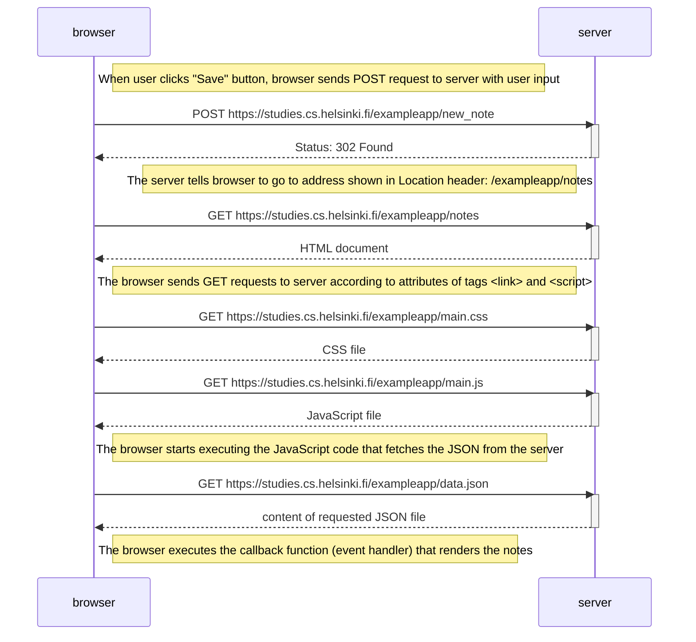

```mermaid
sequenceDiagram
    participant browser
    participant server

    Note right of browser: When user clicks "Save" button, browser sends POST request to server with user input

    browser->>server: POST https://studies.cs.helsinki.fi/exampleapp/new_note
    activate server
    server-->>browser: Status: 302 Found
    deactivate server

    Note left of server: The server tells browser to go to address shown in Location header: /exampleapp/notes

    browser->>server: GET https://studies.cs.helsinki.fi/exampleapp/notes
    activate server
    server-->>browser: HTML document
    deactivate server

    Note right of browser: The browser sends GET requests to server according to attributes of tags <link> and <script>

    browser->>server: GET https://studies.cs.helsinki.fi/exampleapp/main.css
    activate server
    server-->>browser: CSS file
    deactivate server

    browser->>server: GET https://studies.cs.helsinki.fi/exampleapp/main.js
    activate server
    server-->>browser: JavaScript file
    deactivate server

    Note right of browser: The browser starts executing the JavaScript code that fetches the JSON from the server

    browser->>server: GET https://studies.cs.helsinki.fi/exampleapp/data.json
    activate server
    server-->>browser: content of requested JSON file
    deactivate server

    Note right of browser: The browser executes the callback function (event handler) that renders the notes

```
