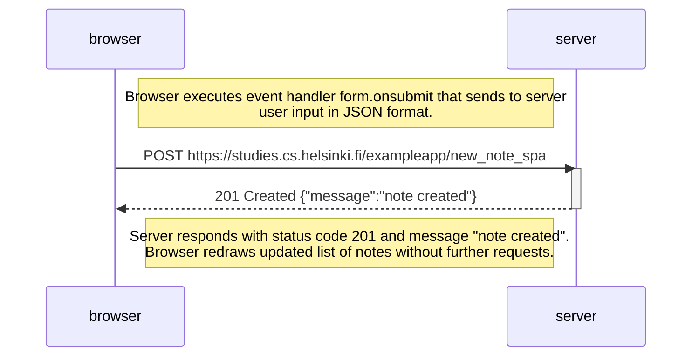

```mermaid
sequenceDiagram
    participant browser
    participant server

    Note right of browser: Browser executes event handler form.onsubmit that sends to server<br/>user input in JSON format.

    browser->>server: POST https://studies.cs.helsinki.fi/exampleapp/new_note_spa
    activate server
    server-->>browser: 201 Created {"message":"note created"}
    deactivate server

    Note left of server: Server responds with status code 201 and message "note created".<br/>Browser redraws updated list of notes without further requests.

```
